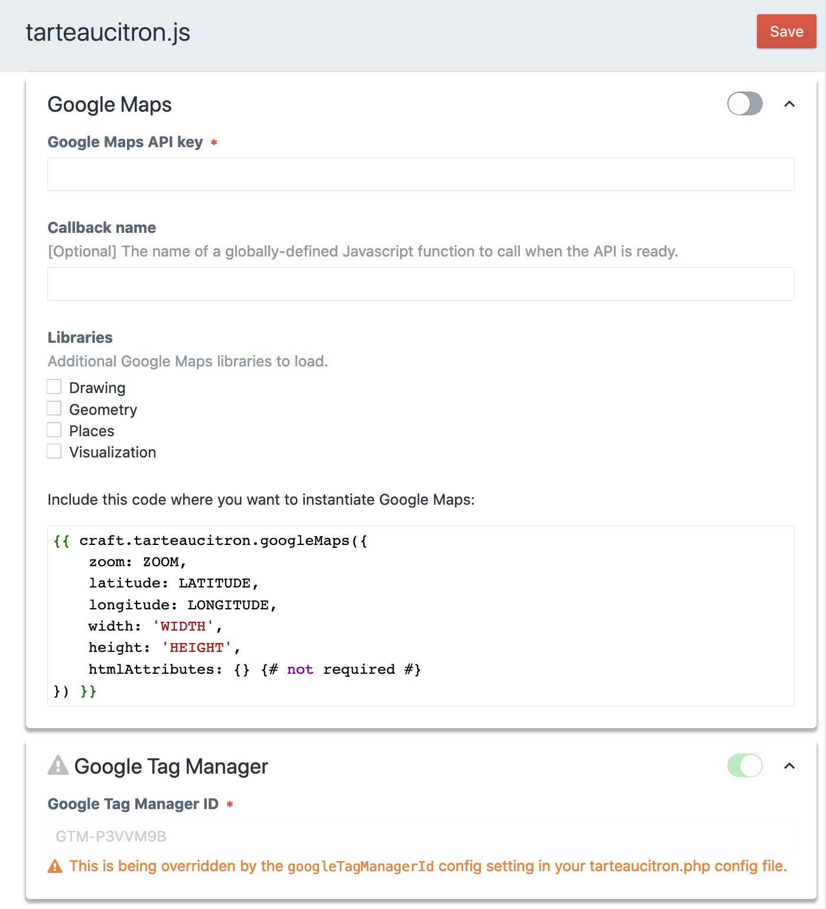

# Craft 3 - tarteaucitron.js

Handle GDPR in your Craft CMS projet the easy way with tarteaucitron.js.

This plugin currently support the following services :
 - Facebook Pixel
 - Google AdWords (conversion)
 - Google AdWords (remarketing)
 - Google Analytics (universal)
 - Google Maps
 - Google Tag Manager
 - Linkedin
 - reCAPTCHA
 - Twitter
 - Vimeo
 - Youtube
 - Youtube Js API


## Requirements

This plugin requires Craft CMS 3.3.0 or later (may work with previous Craft 3
versions but this hasn't been tested).


## Installation

### The easy way

Just install the plugin from the Craft Plugin Store.

### From the command line

```shell script
composer require la-haute-societe/craft-tarteaucitron
./craft install/plugin tarteaucitron
````


## Tarteaucitron plugin Overview

[tarteaucitron.js](https://github.com/AmauriC/tarteaucitron.js) is a javascript
library allowing you to handle GDPR compliance on your site.
It allows end-users to give their consent before exposing them to third party
services (such as Google, Facebook, Twitter…).

This plugin makes the integrating tarteaucitron.js in Craft CMS projects a
breeze.


## Using the Tarteaucitron plugin

### Initialization script

Add the following twig code in the templates where you want the plugin to be
loaded (in the `<head>` section of the layout page for example):

````twig
{{ craft.tarteaucitron.initScript }}
````

### Loading services



The plugin and its associated services are configurable from the plugin settings
page.

To activate a service on your site, you need to activate it and then, depending
on the service, add the given Twig code where you want the service to be loaded.
The Twig code will output a tarteaucitron.js placeholder, that will get replaced
by the content you wanted to load (eg. a YouTube video, a Google Maps…) once
tarteaucitron.js has loaded, and the user has given its consent for the service.

### Service HTML Attributes

For some service templates, you can include a parameter named `htmlAttributes`.
This parameter allows you to define html attributes for the html tag associated
with the service.

Example :

```twig
{{ craft.tarteaucitron.vimeo({
    videoId: 'xxxxxxxx',
    width: '500px',
    height: '200px',
    htmlAttributes: {
        class: 'border-black',
    }
}) }}
```


## Advanced usage

### Manually instantiating services

If for some reason, you'd rather not use the `craft.tarteaucitron.xxx()` methods
to instantiate your services, you can always add the tarteaucitron.js
placeholder element by yourself.

These two examples will have the exact same result (you still need to enable the
Vimeo service in the plugin settings):

````twig
{{ craft.tarteaucitron.vimeo({
    videoId: 'xxxxxxxx',
    width: '500px',
    height: '200px',
    htmlAttributes: {
        class: 'border-black',
    }
}) }}
````

````html
<div
    class="border-black vimeo_player"
    data-videoID="xxxxxxxx"
    data-width="500px"
    data-height="200px"
></div>
````

### Checking if a service is enabled

You may need to check whether a service is enabled (as in "enabled in the
plugin settings", this has nothing to do with whether the user has given
its consent):

````twig

    The site admin decided to disable Twitter widgets.

````

Here are the available `isXXXEnabled()` methods:

  * `isFacebookPixelEnabled()`
  * `isGoogleTagManagerEnabled()`
  * `isReCAPTCHAEnabled()`
  * `isGoogleMapsEnabled()`
  * `isGoogleAnalyticsUniversalEnabled()`
  * `isGoogleAdWordsConversionEnabled()`
  * `isGoogleAdWordsRemarketingEnabled()`
  * `isLinkedInEnabled()`
  * `isTwitterEnabled()`
  * `isVimeoEnabled()`
  * `isYoutubeEnabled()`

### JS - Dynamically adding elements managed by a service

Sometimes you need to dynamically add an element that should be managed by
tarteaucitron.js (eg. you load a page fragment containing a Vimeo video using
AJAX). Adding the tarteaucitron.js placeholder to the DOM isn't enough.
You need to ask tarteaucitron.js to re-render the service :

`````javascript
// Create a tarteaucitron.js Vimeo placeholder element and add it to the document
var div = document.createElement('div');
div.className = 'vimeo_player';
div.attributes['data-videoID'] = 'XXXXXX';
div.dataset.width = '500px';
div.dataset.height = '300px';
document.body.appendChild(document.body.firstChild);

// Make tarteaucitron.js re-render the vimeo service
tarteaucitron.services.vimeo[tarteaucitron.state.vimeo ? 'js' : 'fallback']();
`````

### JS - Reacting to the user giving its consent to a service

Unfortunately, there is no clean way to do this at the moment, but a PR will be
submitted to try to improve tarteaucitron.js.

### Customizing JS output in the page

Instead of using `{{ craft.tarteaucitron.initScript() }}` to output both the
tarteaucitron.js tag and the configuation JS tag, use:
  - `{{ craft.tarteaucitron.javascriptImportTag() }}` to output just the
    tarteaucitron.js import tag
  - `{{ craft.tarteaucitron.javascriptConfigTag() }}` to output just the
    tarteaucitron.js configuration inline JS tag

### Customizing CSS output

By default, tarteaucitron.js imports the _css/tarteaucitron.css_ stylesheet
located next to the _tarteaucitron.js_ file. You can prevent this using the
`useCustomCss` setting of the plugin.
You can provide your own stylesheet or use
`{{ craft.tarteaucitron.stylesheetTag() }}` to output the tarteaucitron.js
stylesheet import tag


## Contribute

Want to contribute? See [CONTRIBUTING.md](./CONTRIBUTING.md)


Brought to you by
<a href="https://www.lahautesociete.com" target="_blank"></a>
