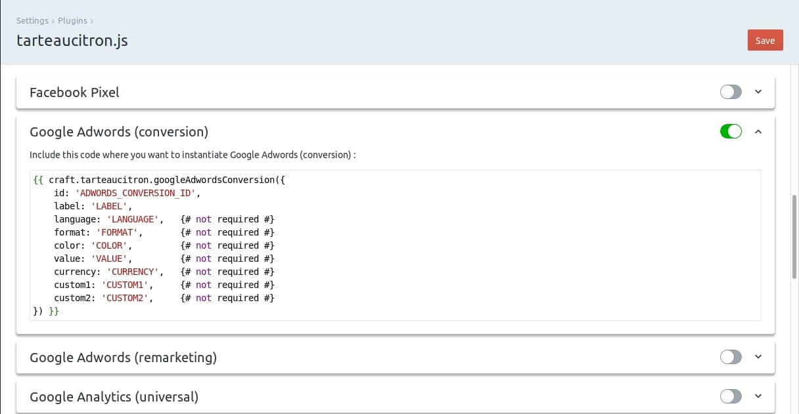

# Craft 3 - tarteaucitron.js

Integration of tarteaucitron.js as a Craft 3 Plugin.

This plugin currently support the following services :
 - Facebook Pixel
 - Google Adwords (conversion)
 - Google Adwords (remarketing)
 - Google Analytics (universal)
 - Google Maps
 - Google Tag Manager
 - Linkedin
 - reCAPTCHA
 - Twitter
 - Vimeo
 - Youtube


## Requirements

This plugin requires Craft CMS 3.0.0-RC1 or later.


## Installation

### The easy way

Just install the plugin from the Craft Plugin Store.

### Using Composer

  - Install with Composer from your project directory: `composer require la-haute-societe/craft-tarteaucitron`
  - In the Craft Control Panel, go to Settings → Plugins and click the **Install** button for **tarteaucitron.js**.


## Tarte au citron plugin Overview

[tarteaucitron.js](https://github.com/AmauriC/tarteaucitron.js) is a javascript library allowing you to handle GPRD compliance on your site. 
It allows the end users to give there consent before exposing them to third party services (such as Google, Facebook, Twitter...).

This plugin makes the integration of tarteaucitron.js as easy as possible in Craft CMS projets.


## Using Tarte au citron plugin

### Initialisation script

Add the following twig code in the templates where you want the plugin to be loaded (in the `<head>` section of the layout page for example):
```twig
{{ craft.tarteaucitron.initScript }}
```

### Loading services



Plugin and associated services are configurable from the plugin settings page.

Depending on the used services in your project, you first have to activate them, then, when required, add the specified twig code on the pages where you want the service to appear. 
Just replace the service parameters specified in the twig code with yours.

### Service HTML Attributes

For some service templates, you can include a parameter named `htmlAttributes`. This parameter allows you to define html parameters for the html tag associated with the service.

Example :

```twig
{{ craft.tarteaucitron.vimeo({
    videoId: '54989781',
    width: '500px',
    height: '200px',
    htmlAttributes: {
        class: 'border-black',
    }
}) }}
```

See [dataAttributes Yii documentation](https://www.yiiframework.com/doc/api/2.0/yii-helpers-basehtml#$dataAttributes-detail).


## Contribute

Want to contribute? See [CONTRIBUTE.md](./CONTRIBUTE.md)


## Tarte au citron plugin Roadmap

* More services support


Brought to you by  [La Haute Société](https://www.lahautesociete.com)